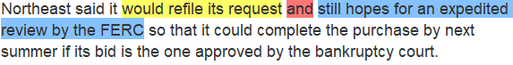

# eng.pdtb.pdtb

## Introduction

The Penn Discourse Treebank (PDTB) is an NSF funded project at the University of Pennsylvania. The goal of the project is to annotate the 1 million word Wall Street Journal corpus in Treebank-2 (LDC95T7) with discourse relations holding between eventualities and propositions mentioned in text, which serve as the arguments to those relations. Discourse relations are assumed to have exactly two arguments. Evidence for relations annotated in the PDTB include: (1) Explicit connectives drawn from a set of syntactically well-defined classes; (2) Sentential adjacency and/or clausal adjaceny, where no Explicit connective has been used to signal the relation; (3) Various phrases and lexico-syntactic constructions, which appear to signal the relation despite the lack of an explicit connective.

The low-level, evidence-grounded approach in the PDTB exposes a clearly defined level of discourse structure which will support the extraction of a range of inferences associated with discourse connectives. More information on the PDTB2.0 is available from [Prasad et al, 2008; Prasad et al, 2012], while detailed information on the PDTB~3.0 is available from [Prasad et al, 2018; Webber et al, 2018].



## DISRPT 2023 Shared Task Information

The data comes from the PDTB 3.0, comprising over 53K discourse relations, including over 12K additional intra-sentential relations that were not annotated in the PDTB 2.0, a revised sense hierarchy, and some standardized decision procedures applied to both newly annotated tokens and tokens previously annotated in the PDTB 2.0.

Syntactic dependency parses are made available using the CoreNLP conversion to UD syntax from the gold Penn Treebank (PTB) constituent trees where possible; however for some sentences whose text or tokenization varies slightly from the version found in the PTB or that are absent from the PTB, automatic parses using UDPipe were introduced.

### Obtaining the Text

Since the underlying Wall Street Journal text cannot be placed openly online, the shared task data has replaced token information with underscores. To reconstruct the data, users must obtain a copy of the LDC release 2.0 of the Penn Treebank Wall Street Journal corpus (LDC95T7) and run the Python script in `utils/process_underscores.py pdtb -m add`. Alternatively, the same files are found in PDTB 3.0 raw file directory, which can be used instead. For more details, run `python utils/process_underscores.py -h`. 

### Notes on Segmentation

Texts in the PDTB are not split into discourse units. Rather, annotation proceeds from using evidence to recognize a potential discourse relation and then verifying it is one. Evidence includes (1) a word or phrase that COULD be an explicit discourse connective that is verified as functioning as a discourse connective; sentences that are adjacent within a paragraph or clauses that are adjacent within a sentence, absent a discourse connective; or clauses within a sentence found in a particular syntactic configuration that correlates with a discourse relation.

Once a discourse relation is annotated, there will be several segments:
  * one or more segments expressing Arg1 of the relation
  * one or more segments expressing Arg2 of the relation
  * usually one segment corresponding to an explicit connective if one is present in the relation (but possibly more, for discontinous connectives)
  * one or more segments that are OUTSIDE the given relation
  * optionally, a segment (either outside the relation, or within one of the arguments) indicating the attribution of the relation
  * optionally, in the absense of an explicit connective, segments WITHIN one or both arguments that is taken to provide evidence for that relation.

Each relation segments a text independently. Segments may be discontinuous, and within a sentence, which (potentially discontinuous segments) correspond to Arg1 and which to Arg2 depends on whether the syntactic elements representing Arg1 and Arg2 are in a syntactically coordinating or a syntactically subordinating relation.  In the former, Arg1 precedes Arg2. In the latter, Arg2 is associated with the syntactically subordinate constituent, whether it is to the left or right of Arg1.

With respect to the PDTB, the DISRPT task only requires identifying segments corresponding to the explicit connectives in the text.

  * Labelling a token with "Seg=B-Conn" indicates that it is at the beginning of an explicit connective.
  * Labelling a token with "Seg=I-Conn" indicates that it is a continuation of the start of the connective
   to its left;
  * Labelling a token with "_" indicates that is is outside the segment to its left.

The following illustrate DISRPT labelling of a sentence (abbreviated to B/I) with several distinct connectives (including a modified connective 'especially if') and of a sentence with a discontinuous connective ('not only ... but also').

(from wsj_0553: Explicit connectives 'but', 'in the end", 'especially if', 'as')

```
But in the end his resignation as Chancellor of the Exchequer may be a good thing , especially if
 B  B   I   I   _     _        _      _      _   _     _       _   _ _  _     _   _     B       I
it works as he no doubt intends -- by forcing Prime Minister Thatcher and her counterparts elsewhere
 _  _    B  _  _    _     _      _  B     _      _      _        _     _   _       _          _
to confront the genuine intellectual issues involved . 
 _    _      _     _         _          _      _
```

(from wsj_0445: Explicit connectives 'by', 'not only ... but also')

```
By increasing the number of PCs it uses from 66 to 1,000 , Omron Tateishi Electronics Co. , of Kyoto ,
 B     _       _    _    _   _   _  _     _   _  _   _   _   _      _         _        _  _  _  _    _
hopes not only to make certain tasks easier but also to transform the way the company is run .
 _     B   I    _  _      _      _     _     B   I    _     _      _   _   _     _     _  _  _
```

### Notes on Relation Classification 

The predicted label (the last column) for each instance has been truncated at Level-2. For instance, the predicted label for the sense label “Temporal.Asynchronous.Precedence” would be “Temporal.Asynchronous”. However, we keep the original label in the third-to-last column called “orig_label”, which matches the directionality information provided in the “dir” column. Moreover, when there are multiple sense labels available, the sense label that has a lower frequency (the frequency is based on Level-2 relations) is chosen as the sense label to predict, and the directionality information thus corresponds to this chosen sense. Both sense labels are included in the “orig_label”, separated by a semicolon. This dataset contains discontinuous discourse units.

## References

1. Prasad, Rashmi, Nikhil Dinesh, Alan Lee, Eleni Miltsakaki, Livia Robaldo, Aravind Joshi, and Bonnie Webber (2008). 
[The Penn Discourse TreeBank 2.0](https://aclanthology.org/L08-1093/). Proceedings, 6th International Conference on Language Resources and Evaluation, Marrakech, Morocco, pp. 2961--2968.
   ```
   @inproceedings{prasad-etal-2008-penn,
    title = "The {P}enn {D}iscourse {T}ree{B}ank 2.0.",
    author = "Prasad, Rashmi  and
      Dinesh, Nikhil  and
      Lee, Alan  and
      Miltsakaki, Eleni  and
      Robaldo, Livio  and
      Joshi, Aravind  and
      Webber, Bonnie",
    booktitle = "Proceedings of the Sixth International Conference on Language Resources and Evaluation ({LREC}'08)",
    month = may,
    year = "2008",
    address = "Marrakech, Morocco",
    publisher = "European Language Resources Association (ELRA)",
    url = "http://www.lrec-conf.org/proceedings/lrec2008/pdf/754_paper.pdf",
    abstract = "We present the second version of the Penn Discourse Treebank, PDTB-2.0, describing its lexically-grounded annotations of discourse relations and their two abstract object arguments over the 1 million word Wall Street Journal corpus. We describe all aspects of the annotation, including (a) the argument structure of discourse relations, (b) the sense annotation of the relations, and (c) the attribution of discourse relations and each of their arguments. We list the differences between PDTB-1.0 and PDTB-2.0. We present representative statistics for several aspects of the annotation in the corpus.",
   }
   ```

2. Prasad, Rashmi, Bonnie Webber, and Alan Lee (2018). 
[Discourse annotation in the PDTB: The next generation](https://aclanthology.org/W18-4710/). Proceedings 14th Joint ACL - ISO Workshop on Interoperable Semantic Annotation, pp. 87--97.
   ```
   @inproceedings{prasad-etal-2018-discourse,
    title = "Discourse Annotation in the {PDTB}: The Next Generation",
    author = "Prasad, Rashmi  and
      Webber, Bonnie  and
      Lee, Alan",
    booktitle = "Proceedings 14th Joint {ACL} - {ISO} Workshop on Interoperable Semantic Annotation",
    month = aug,
    year = "2018",
    address = "Santa Fe, New Mexico, USA",
    publisher = "Association for Computational Linguistics",
    url = "https://aclanthology.org/W18-4710",
    pages = "87--97",
   }
   ```

3. Webber, Bonnie, Rashmi Prasad, Alan Lee, and Aravind Joshi (2018). 
[The Penn Discourse TreeBank 3.0 Annotation Manual](https://www.google.com/url?sa=t&rct=j&q=&esrc=s&source=web&cd=&ved=2ahUKEwjOvJWJ_aL9AhVXlIkEHVRgC4MQFnoECBoQAQ&url=https%3A%2F%2Fcatalog.ldc.upenn.edu%2Fdocs%2FLDC2019T05%2FPDTB3-Annotation-Manual.pdf&usg=AOvVaw17OrkhUOL-qh3i1SMp14pK). Technical report, University of Pennsylvania. Available from the LDC catalogue, LDC2019T05.
   ```
   @Misc{PrasadWebberLeeEtAl2019,
     author       = {Rashmi Prasad and Bonnie Webber and Alan Lee and Aravind Joshi},
     year         = {2019},
     title        = {{Penn Discourse Treebank Version 3.0. LDC2019T05}},
     organization = {Linguistic Data Consortium},
     address      = {Philadelphia}
   }
   ```
